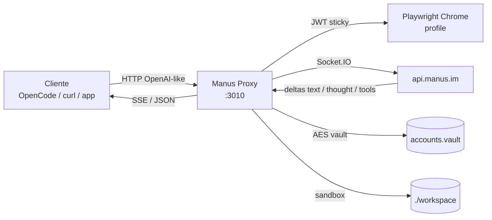
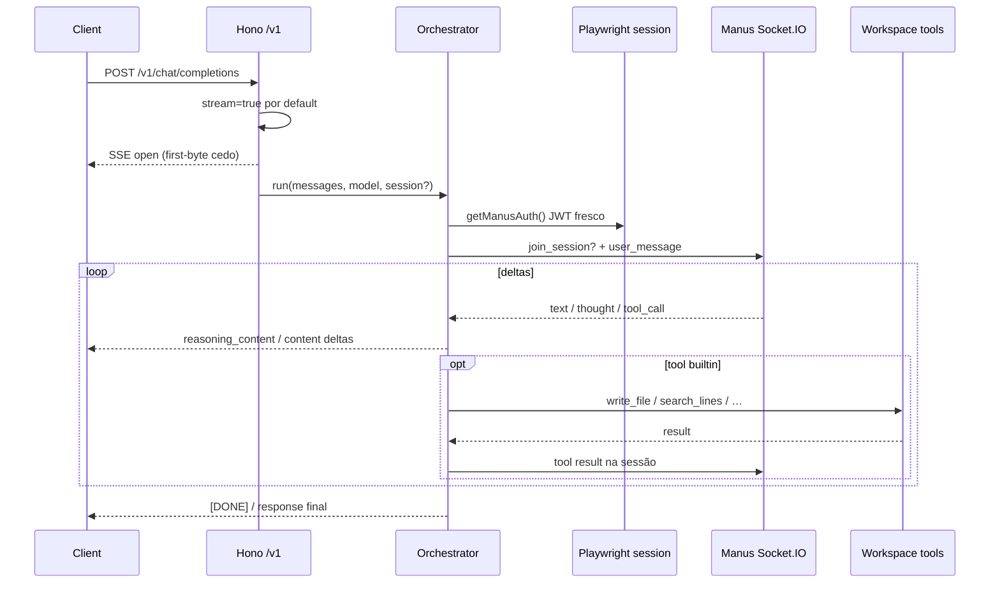
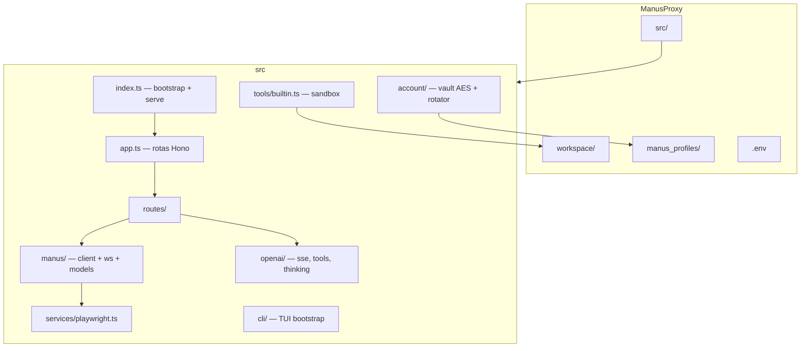

<p align="center">
  
</p>

<p align="center">
  
</p>

<h1 align="center">Manus Proxy <sup>v0.1.0</sup></h1>

<p align="center">
  <strong>Proxy local OpenAI-compatible</strong> para a Manus — chat, agent, stream SSE, tools e multi-conta.<br/>
  Cole na OpenCode, Continue, Cursor, ou qualquer cliente que fale a API da OpenAI.
</p>

<p align="center">
  <a href="#-no-ar-em-5-minutos">Quick start</a> ·
  <a href="#-api">API</a> ·
  <a href="#-como-funciona-visão-técnica">Arquitetura</a> ·
  <a href="#-configuração">Config</a>
</p>

---

## O que é

A Manus não expõe uma API OpenAI pública estável para o que a web faz.  
**Manus Proxy** resolve isso no seu PC:

1. Você faz login **uma vez** no Chrome (sticky profile + Turnstile humano)
2. O proxy reutiliza a sessão (JWT) e fala com `api.manus.im` via Socket.IO
3. Clientes usam `http://localhost:3010/v1/*` como se fosse OpenAI

| Feature | Status |
|--------|--------|
| `POST /v1/chat/completions` | ✅ stream default-on |
| `POST /v1/responses` + continuidade | ✅ `previous_response_id` / `session_id` |
| Thinking / reasoning no SSE | ✅ `reasoning_content` (OpenCode-friendly) |
| Multi-conta + vault AES-256-GCM | ✅ |
| Workspace tools sandboxed | ✅ |
| Imagens `data:image/...;base64` | ✅ |
| Cancel de run / disconnect | ✅ stop no WS Manus |
| Chrome headless por default | ✅ |

---

## ⚡ No ar em 5 minutos

> Para quem só quer **usar**. Sem teoria.

### Requisitos

- **Node.js 20+**
- **Google Chrome** instalado (recomendado)
- Conta na [manus.im](https://manus.im)

### 1. Clone e instale

```bash
git clone https://github.com/AnThophicous/ManusProxy.git
cd ManusProxy
npm install
```

### 2. Ambiente

```bash
# Windows
copy .env.example .env

# macOS / Linux
cp .env.example .env
```

Opcional no `.env` (pode deixar vazio no começo):

```env
PORT=3010
API_KEY=
BROWSER=chrome
MANUS_HEADLESS=true
MANUS_STORE_SECRET=troque-por-uma-frase-longa
```

### 3. Login (só na primeira vez)

```bash
npm run login:chrome
```

- Abre o Chrome **com UI**
- Faça login na Manus (e-mail + Turnstile)
- Quando o proxy detectar sessão válida, pode fechar

Profile fica em `manus_profiles/default/`. **Não commite essa pasta.**

### 4. Subir a proxy

```bash
npm start
```

Você deve ver o bootstrap (logo Manus → checks → banner **MANUS PROXY**) e algo como:

```text
http://localhost:3010
```

### 5. Teste rápido

```bash
curl http://localhost:3010/health
```

```bash
curl http://localhost:3010/v1/chat/completions ^
  -H "Content-Type: application/json" ^
  -d "{\"model\":\"manus-chat\",\"messages\":[{\"role\":\"user\",\"content\":\"oi\"}]}"
```

(macOS/Linux: troque `^` por `\`.)

### 6. Plugue no seu cliente

| Campo | Valor |
|-------|--------|
| Base URL | `http://localhost:3010/v1` |
| API Key | o valor de `API_KEY` no `.env` (ou qualquer coisa se `API_KEY` estiver vazio) |
| Model | `manus-chat` · `manus-agent` · `manus` · `manus-adaptive` |

**OpenCode / OpenAI-compatible clients:** base URL apontando para `http://localhost:3010/v1`.

Pronto. Se travou no login, rode `npm run login:chrome` de novo. Se a porta estiver ocupada, mude `PORT` no `.env`.

---

## 🗺️ Mapa mental (Mermaid)

### Fluxo do request (visão rápida)



### Pipeline interno de um chat



### Estrutura de pastas (o que importa)



---

## 📡 API

Base: `http://localhost:3010`

| Método | Rota | O que faz |
|--------|------|-----------|
| `GET` | `/health` | status, contas, features |
| `GET` | `/v1/models` | lista de models |
| `GET` | `/v1/models/:id` | model único |
| `POST` | `/v1/chat/completions` | chat OpenAI-like (SSE default) |
| `POST` | `/v1/responses` | Responses API + continuidade |
| `GET` | `/v1/responses/:id` | busca response no store |
| `DELETE` | `/v1/responses/:id` | apaga (e cancela se ativo) |
| `POST` | `/v1/responses/:id/cancel` | cancela run |
| `GET` | `/v1/runs/active` | gerações em voo |
| `GET` | `/v1/accounts` | lista contas |
| `POST` | `/v1/accounts` | cria id de conta |
| `POST` | `/v1/accounts/default` | define default |
| `DELETE` | `/v1/accounts/:id` | remove conta |

### Models

| id | uso |
|----|-----|
| `manus` / `manus-chat` | chat |
| `manus-agent` | modo agent |
| `manus-adaptive` | adaptive |

### Headers úteis

| Header | Quando |
|--------|--------|
| `Authorization: Bearer <API_KEY>` | se `API_KEY` estiver no `.env` |
| `x-manus-account: <id>` | escolher conta (senão usa default) |

### Stream

Por default **streama**. Só desliga se mandar `"stream": false`.

Thinking da Manus aparece como:

```json
{
  "choices": [{
    "delta": {
      "reasoning_content": "…pensamento…"
    }
  }]
}
```

Controle via `MANUS_THINK_MODE` (`reasoning_content` | `both` | `content_tags` | `off`).

---

## 🧵 Continuidade de sessão (economia de tokens)

A Manus tem sessão real (`join_session`). O proxy **não reenvia o histórico inteiro** no follow-up.

### Responses API

```http
POST /v1/responses
Content-Type: application/json
```

```json
{
  "model": "manus-chat",
  "input": "Lembre que meu nome é Elaine",
  "session_id": "conv-1"
}
```

Depois:

```json
{
  "model": "manus-chat",
  "input": "Qual é meu nome?",
  "previous_response_id": "resp_xxx"
}
```

Aliases: `last_response_id` ≡ `previous_response_id`.

### Chat completions

```json
{
  "model": "manus-chat",
  "session_id": "<session_da_resposta_anterior>",
  "messages": [{ "role": "user", "content": "continua" }]
}
```

---

## 🧰 Tools (host = OpenCode / Codex / builtins)

A Manus **não** é o disco do seu PC. Se ela gravar em `/home/ubuntu/...` no sandbox da nuvem, **você não vê o arquivo**.

Com tools no request (OpenCode, Codex, etc.):

1. O proxy manda um **HOST TOOLS PROTOCOL** forte
2. Por default força `taskMode=chat` (`MANUS_FORCE_CHAT_WITH_TOOLS`) para a Manus **emitir** `<tool_call>` em vez de “Build” no VM remoto
3. Tool calls do **cliente** voltam como OpenAI `tool_calls` → o OpenCode/Codex executa no **seu** workspace
4. Tools **builtin** da proxy rodam local em `./workspace` (desligue com `MANUS_BUILTIN_TOOLS=0`)

| Builtin | Função |
|---------|--------|
| `workspace` | root + árvore |
| `write_file` / `read_file` | FS local |
| `list_dir` / `mkdir` / `delete_path` / `move_path` | FS local |
| `replace_in_file` / `search_files` / `search_lines` / `file_info` | edição/busca |
| `manual_fetch` | HTTP fetch |

Cliente manda `tools` no formato OpenAI; a Manus deve emitir:

```xml
<tool_call>
{"name":"write","arguments":{"path":"calculadora.html","content":"..."}}
</tool_call>
```

Se a resposta só citar `/home/ubuntu/...`, o proxy **pede um reenvio** via host `tool_call` (uma vez).

---

## 🔐 Multi-conta

```bash
# conta default
npm run login:chrome

# outra conta
npm run login -- --account=trabalho --browser=chrome
```

- Profiles: `manus_profiles/<id>/`
- Vault: `manus_profiles/accounts.vault.json` (AES-256-GCM)
- Chave: `MANUS_STORE_SECRET` ou auto `manus_profiles/.store_key`

Rotação por créditos quando há várias contas no pool.

**Nunca suba no Git:** `manus_profiles/`, `.store_key`, `*.vault.json`, `.env`.

---

## ⚙️ Configuração

| Variável | Default | Descrição |
|----------|---------|-----------|
| `PORT` | `3010` | porta HTTP |
| `API_KEY` | vazio | se setado, exige Bearer |
| `BROWSER` | `chrome` | `chrome` / `chromium` / `edge` / `firefox` |
| `MANUS_HEADLESS` | `true` | UI só no login / `--headed` |
| `MANUS_ACCOUNT` | `default` | conta default |
| `MANUS_WORKSPACE` | `./workspace` | root das tools |
| `MANUS_STORE_SECRET` | auto keyfile | segredo do vault |
| `MANUS_THINK_MODE` | `reasoning_content` | como expõe thinking |
| `MANUS_WS_DEBUG` | `false` | frames Socket.IO no log |

Scripts úteis:

```bash
npm start                 # headless chrome
npm run start:headed      # com UI do browser
npm run login:chrome      # login interativo
npm run session           # checa sessão
npm run test:chat         # smoke chat
```

---

## 🧠 Como funciona (visão técnica)

### Ideia central

```text
Cliente OpenAI-like
        │
        ▼
   Hono (src/app.ts)
        │
        ├─ routes/chat.ts / responses.ts
        │       │
        │       ▼
        │  orchestrator/run.ts
        │       │
        │       ├─ account vault + rotator
        │       ├─ response-store (previous_response_id → session Manus)
        │       ├─ tools/builtin.ts (sandbox)
        │       └─ manus/*
        │              ├─ client.ts  (HTTP api.manus.im)
        │              └─ ws.ts      (Socket.IO chat deltas)
        │
        └─ services/playwright.ts
                 sticky profile → cookies/JWT frescos
```

### Camadas

| Camada | Pasta | Papel |
|--------|-------|-------|
| Bootstrap / TUI | `src/cli/` | ASCII logo, warm checks, banner, logs append-only |
| HTTP surface | `src/routes/`, `app.ts` | contrato OpenAI |
| Orquestração | `src/orchestrator/` | lifecycle do run, tools loop, cancel |
| Manus protocol | `src/manus/` | auth user info, WS, autonomy, models |
| OpenAI shaping | `src/openai/` | SSE, thinking stream, tool parse, errors |
| Contas | `src/account/` | crypto AES-GCM, store, pool, rotator |
| Browser | `src/services/playwright.ts` | profile isolado por conta |
| Tools | `src/tools/builtin.ts` | FS sandbox + fetch |

### Autenticação Manus

1. Playwright abre (ou reusa) profile em `manus_profiles/<account>/`
2. Navega `manus.im` — se não logado, fluxo de login humano (Turnstile)
3. Extrai tokens/cookies da sessão web
4. Proxy usa JWT nas chamadas `api.manus.im` e no handshake Socket.IO
5. Chat real roda no WS: `join_session` (continuidade) + `user_message`

### Por que sticky profile?

JWT da Manus expira / depende de sessão browser. Profile Playwright evita login a cada request e mantém o mesmo “browser fingerprinted” da conta.

### Stream e first-byte

O proxy **abre o SSE cedo** (antes de autenticar/esperar o modelo), para clientes sensíveis a TTFB (OpenCode, etc.) não caírem em timeout. Comentários SSE de progresso podem aparecer enquanto o browser aquece.

### Autonomy

Em modo agent, o proxy injeta diretriz para a Manus **não ficar parada esperando o usuário** quando a tarefa pode avançar sozinha. Quando a Manus **realmente** pede input humano (HITL):

| API | Sinal |
|-----|--------|
| `/v1/responses` | `status: "incomplete"`, `reason: "awaiting_user_input"` |
| stream | `manus.requires_input` |
| chat | `requires_action: true` |

Continue com a **mesma** `previous_response_id` / `session_id`.

### Cancel

- Cliente aborta SSE → proxy manda `stop` no WS Manus
- `POST /v1/responses/:id/cancel` → idem
- `GET /v1/runs/active` lista o que está voando

### Segurança (local)

| Item | Como |
|------|------|
| Metadata de contas | AES-256-GCM |
| Response store em disco | AES-256-GCM |
| Profiles de browser | isolados por conta |
| Paths de tools | não saem do workspace |
| Logs | JWT redacted; e-mail mascarado na API |

Isto é um **proxy local**. Quem tem acesso à porta tem acesso à sua sessão Manus. Use `API_KEY` e firewall se for expor na rede.

---

## 🖼️ Imagens

```json
{
  "model": "manus-chat",
  "messages": [{
    "role": "user",
    "content": [
      { "type": "text", "text": "O que tem na imagem?" },
      {
        "type": "image_url",
        "image_url": { "url": "data:image/png;base64,iVBOR..." }
      }
    ]
  }]
}
```

---

## ❗ Problemas comuns

| Sintoma | O que tentar |
|---------|----------------|
| Não loga / sessão inválida | `npm run login:chrome` de novo |
| Porta em uso | mude `PORT` ou mate o processo na 3010 |
| Profile lock / Playwright estranho | feche outras instâncias do proxy; um process por profile |
| Cliente não streama thinking | confira `MANUS_THINK_MODE=reasoning_content` |
| Tools escrevem “fora” | paths relativos ao `workspace/` |
| 401 nas rotas `/v1` | `API_KEY` setado → mande `Authorization: Bearer …` |

---

## 📦 Stack

- **Runtime:** Node + TypeScript (`tsx`)
- **HTTP:** [Hono](https://hono.dev)
- **Browser:** Playwright (`channel: chrome` por default)
- **Realtime:** `socket.io-client` → `wss://api.manus.im`
- **Crypto:** AES-256-GCM (vault + store)

---

## 📜 Licença

**[ISC License](./LICENSE)** — permissiva (não é MIT).  
Use, copie, modifique e distribua; mantenha o aviso de copyright.  
O software é fornecido **“AS IS”**, sem garantias.

Respeite também os **termos de uso da Manus**.  
Profiles, cookies, vault e `.env` são **seus dados** — não publique.

---

## ⚠️ Disclaimer

### Manutenção

Este é um projeto **para estudo / uso pessoal**.  
**AnThophicous** **não** se compromete a entregar atualizações semanais (nem em qualquer cadência fixa), **não** deve isso a ninguém, e **não** garante que o projeto continue ativo, mantido ou “no ar” para sempre.  
Pode parar, mudar de rumo ou ser abandonado a qualquer momento, sem aviso.

### Responsabilidade

- Você usa **por sua conta e risco**.
- O autor **não se responsabiliza** por banimento de conta, perda de créditos, vazamento de sessão, dados apagados, downtime, uso indevido, ou qualquer dano direto/indireto ligado a este software.
- Não há garantia de funcionamento, segurança, compatibilidade com a API da Manus, nem de adequação a qualquer propósito.
- Expor a proxy na rede sem `API_KEY` / firewall é risco **seu**.
- Em caso de dúvida: leia o código, entenda o que roda na sua máquina, e decida sozinho se vale usar.

**Resumo:** estudo open-source. Sem SLA. Sem suporte obrigatório. Sem garantia.

---

<p align="center">
  
  <br/>
  <sub>Manus Proxy v0.1.0 · OpenAI-compatible · local-first · ISC</sub>
  <br/>
  <a href="https://github.com/AnThophicous/ManusProxy">github.com/AnThophicous/ManusProxy</a>
</p>
